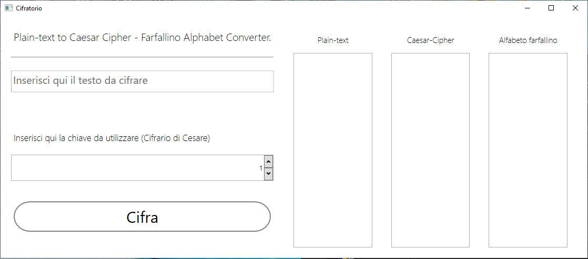
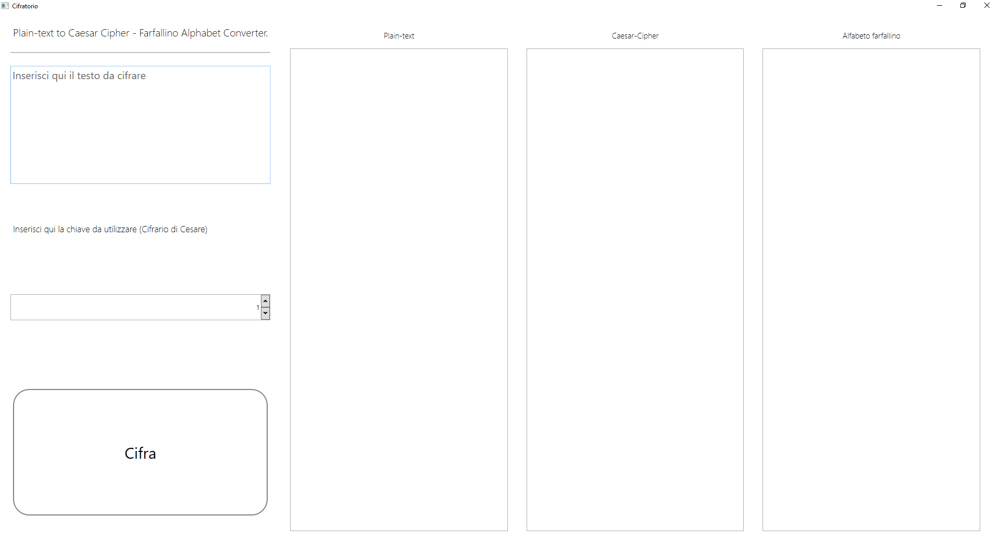

# Cifrante
### Plain-text to Caesar-cypher, "farfallino" alphabet converter

Seconda esercitazione didattica utilizzo framework WPF + C#.

## Features

- _Resizable form_
- _Distinguishes between upperCase and lowerCase characters_
- _Modern UI._

Maximum key value is **purposely set on 26**, doesn't treat numbers and other non-Alphabetic characters (whitespaces,special characters) as the real Caesar-cypher does.

Default Size             |  Fullscreen
-------------------------|-------------------------
  | 

**This software is distributed under free license,do whatever you want with this!**
